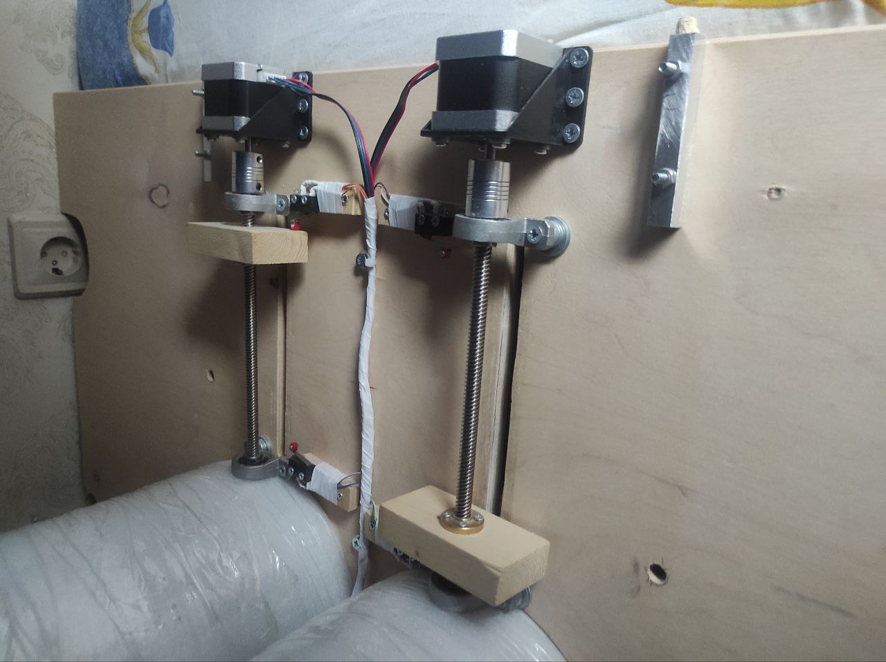
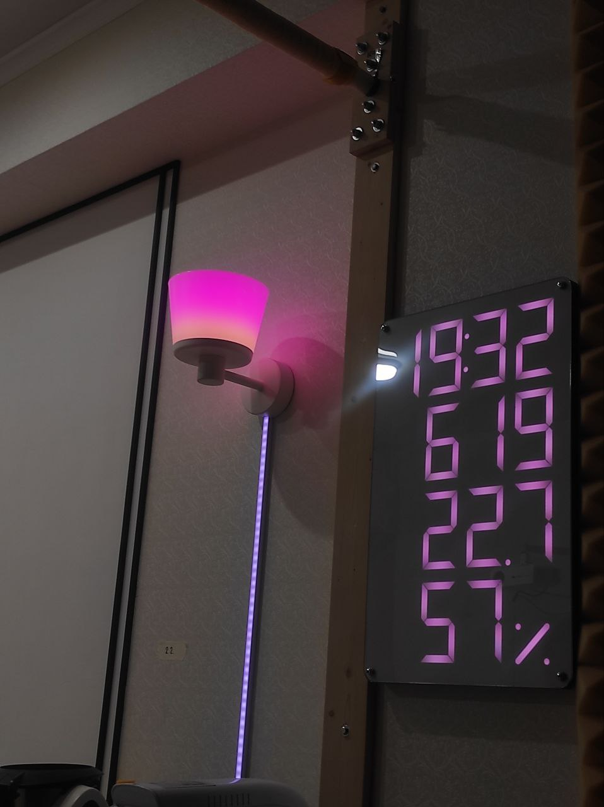
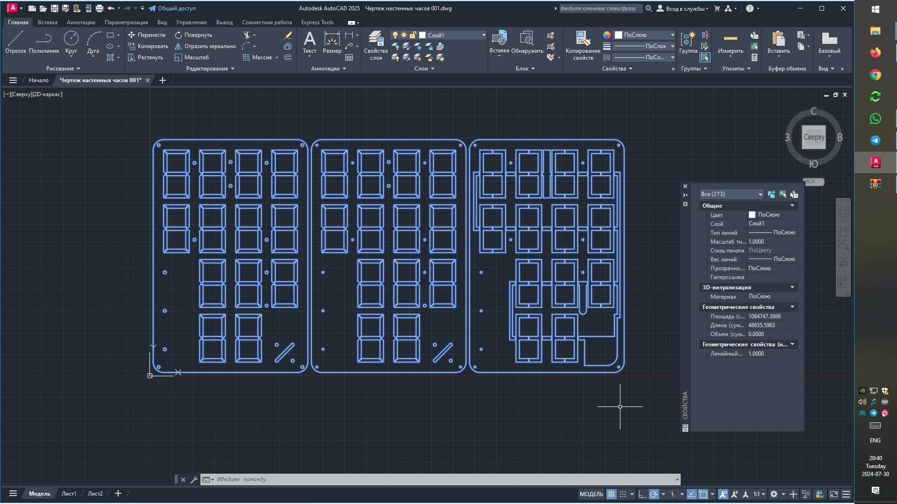
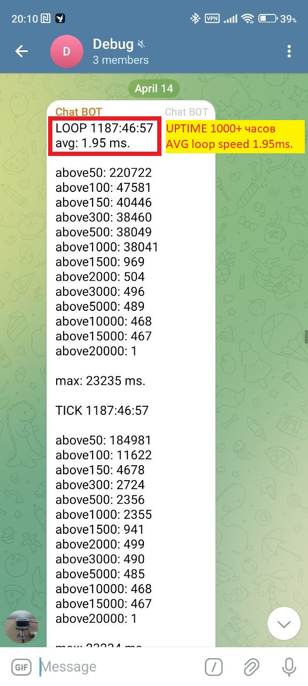
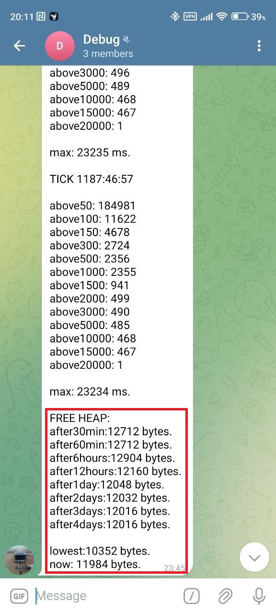

# !!!ВАЖНО!!! в проекте используется /// для структуры и разбивки кода на разделы.

# О проекте

#### Введение

"Этот проект представляет собой *полностью автоматизированную систему климат-контроля с удаленным управлением* для квартиры, включающую в себя приточно-вытяжную вентиляцию с рекуперацией, фильтрацией и увлажнением. Основная цель — обеспечить комфортный микроклимат, а заодно изучить embedded."

#### Features

- [x] Полностью спроектированная, собранная и автоматизированная приточно-вытяжная система вентиляции + увлажнение + рекуперация + информационное табло.
- [x] UPTIME 2000+ часов (без перезагрузок).
- [x] Две ESP-8266 с независимым питанием и heart-beat control по com-порту.
- [x] Датчики температуры, влажности, со2.
- [x] log показаний на SD карту в excel-совместимом CSV формате.
- [x] Две воздушные заслонки на шаговых двигателях. (климат контроль, предотвращение обмерзания рекуператора).
- [x] Для управления заслонок с нуля написана логика управления + калибровка через концевики, как у ЧПУ.
- [x] Telegram BOT (alert) - оповешения об ошибках, критических температурах.
- [x] Telegram BOT (settings) - гибкая настройка климат контроля, яркости табло, бра, ночного режима итд итп
- [x] Telegram BOT (debugger) - задержки, free heap, uptime.
- [x] Настенное информационное табло на аддресной LED ленте (время/со2/температура/влажность).
- [x] Бра на адресной LED ленте (анимация раз в минуты во время синхронизации данных + анимации при ошибках).
- [x] Unit-тестирование (если что-то где-то глючит/сломалось - скорее всего, придёт alert).
- [x] Доступ к боту организован через валидацию токена по белым спискам с различными правми доступа.
- [x] Для датчиков используется витая пара, в каждой паре GND + DATA. (борьба с помехами, максимальная длинна ~12 метров, в сумме 50-100 метров витой пары).

#### Возможные улучшения

- [ ] Заменить `String` на `char[]`
   (Да, я знаю, что это решит проблему фрагментации и статические буферы лучше динамически выделяемой памяти. Но эта проблема есть только при стресс тестах. Нет, я не буду рефакторить код ещё раз =0)

- [ ] Управление шаговиками через таймеры
   (Да, это более продвинутое решение. Нет, я не буду этого делать =0)

# Настройки прошивки

*  Tools > MMU 16KB cache + 48KB IRAM and 2nd HEAP (shared)
*  Tools > Stack Protection Enable
*  NodeMCU 1.0 (ESP-12E Module)

# Версии Библиотек

| Библиотека                 | Версия   |
| -------------------------- | -------- |
| NTPClient                  | 3.2.1    |
| Adafruit BusIO             | 1.16.1   |
| Adafruit GFX Lubrart       | 1.11.10  |
| Adafruit SH110X            | 2.1.10   |
| Adafruit SHT4x Library     | 1.0.4    |
| Adafruit SSD1306           | 2.5.10   |
| Adafruit United Sensor     | 1.1.14   |
| Arduinojson                | 7.1.0    |
| DallasTemperature          | 3.9.0    |
| FastLED                    | 3.7.0    |
| OneWire                    | 2.3.8    |
| Sensirion Core             | 0.7.1    |
| Sensirion I2C SCD 4x       | 0.4.0    |
| FastBot2                   | 1.0.11   |
              

# Используемые компоненты на 2024-10-29

| Кол-во | Компонент                    | Модель                                 |
| ------ | ---------------------------- | -------------------------------------- |
| 2      | Микроконтроллер              | NodeMCU Lua v3 (ESP8266)               |
| 2      | Шилд для NodeMCU             | NodeMCU Base v1.0 (NodeMCU breadboard) |
| 3      | Микрошаговый драйвер         | TMC2209                                |
| 3      | Шилд для TMC2209             | Expansion board for A4988              |
| 3      | Шаговый двигатель Nema 17    | US-17HS4401                            |
| 4      | Концевик                     | KW12-lun                               |
| 2      | Шаговый винт                 | T8, pitch 2mm, lead 8mm                |
| 2      | Латунная гайка               | T8, pitch 2mm, lead 8mm                |
| 2      | Алюминиевая муфта            | 5х10мм                                 |
| 4      | Опора вала с подшипником 8мм | -                                      |
| 8      | Датчик температуры OneWire   | DS18B20 (12bit)                        |
| 1      | Датчик влажности i2c         | SHT41                                  |
| 1      | Датчик CO₂                   | SCD41                                  | 
| 1      | SD card reader               | -                                      |
| 3      | Блок питания 220AC/5DC       | -                                      |
| 2      | Блок питания 220AC/12DC      | -                                      |
| -      | Адрессная LED лента          | 5v WS2812B (60 LED на метр)            |

# Комментарии

* Немного о шаговых двигателях и функциях stepsSTREET8 и stepsHOME8. Дело в том, что шаговый двигатель имеет определенное физическое количество шагов на один оборот. для nema 17 - это 200 шагов на один оборот вала. Но сами по себе шаговые двигатели довольно шумные. по этому, используется драйвер шаговыго двигателя. драйвер добавляет промежуточные шаги (микрошаги). Конктретно этот драйвер я настроил на деление каждого шага на 8 микрошагов. можно было выбрать и делитель выше, вплодь до 64, но на 8 микрошагах он уже бесшумен. Дело еще в том, что ESP имеет несколько другую архитектуру, чем ардуино. ESP не поддерживает задержки в микросекундах, по этому в функции используется delay(1), как минимально возможное. Использование delayMicroseconds - крэшит программу. Так как через команду мы делаем 1 микрошаг, то 8 микрошагов составят 1 реальный шаг двигателя. По этому, было принято решение считать и останавливаться именно на реальных шагах двигателя, а не между ними. Полагаю, что это уменьшит относительныз дрифт (смещение) в процессе работы и добавит стабильности. Избыточно? Возможно. В любом случае, ежедневная калибровка избавит от возможного дрифта со временем из-за возможных пропусков шагов. И как бонус - проверить, что концевики работают (ну по крайней мере 2 из 4 =0).

* Шилд хоть и для A4988, но с TMC2209 тоже работает, по крайней мере в режиме STEP/DIR.

* Переменные для температур оставлены в буквенно-цифровом варианте из-за того, что названия были бы слишком длинные. Проще использовать короткие переменные и смотреть описание в комментарях чуть выше. a2-a8 это показания с датчиков. перменные b** это результаты расчетов итд.

# Принципиальная схема

Сделано с помощью EasyEDA.com
https://oshwlab.com/narayanabox/climate-cobtrol

# Фотографии

# Скриншоты

