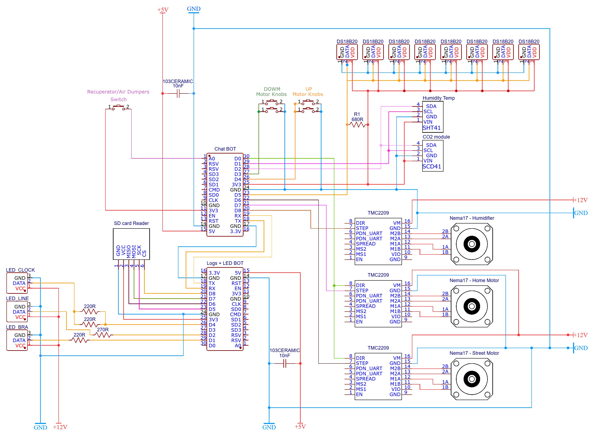

# Короткое описание проекта

#### !!!ВАЖНО!!! в проекте используеются /// для структуры и разбивки кода на разделы.

#### В общих чертах проект включает в себя на 2024-11-08:

- [x] Полностью спроектированная, собранная и автоматизированная приточно-вытяжная система вентиляции + увлажнение + рекуперация + информационное табло.
- [x] Две ESP-8266 с независимым питанием и heart-beat control по com-порту.
- [x] Датчики температуры, влажности, со2.
- [x] log показаний на SD карту в excel-совместимом CSV формате.
- [x] Две воздушные заслонки на шаговых двигателях. (климат контроль, предотвращение обмерзания рекуператора).
- [x] Для управления заслонок с нуля написана логика управления + калибровка через концевики, как у ЧПУ.
- [x] Telegram BOT (alert) - оповешения об ошибках, критических температурах.
- [x] Telegram BOT (settings) - гибкая настройка климат контроля, яркости табло, бра, ночного режима итд итп
- [x] Telegram BOT (debugger) - задержки, free heap, uptime.
- [x] Настенное информационное табло на аддресной LED ленте (время/со2/температура/влажность).
- [x] Бра на адресной LED ленте (анимация раз в минуты во время синхронизации данных + анимации при ошибках).
- [x] Unit-тестирование (если что-то где-то глючит/сломалось - скорее всего, придёт alert).
- [x] Доступ к боту организован через валидацию токена по белым спискам с различными правми доступа.
- [x] Для датчиков используется витая пара, в каждой паре GND + DATA. (борьба с помехами, максимальная длинна ~12 метров, в сумме 50-100 метров витой пары).


#### Дальнейший план разработки:

- [ ] Отладка/дебаггинг/оптимизация

# Настройки в ардуино перед прошивкой

*  Tools > MMU 16KB cache + 48KB IRAM and 2nd HEAP (shared)
*  Tools > Stack Protection Enable
*  NodeMCU 1.0 (ESP-12E Module)


# Версии Библиотек 

| Библиотека                 | Версия   |
| -------------------------- | -------- |
| NTPClient                  | 3.2.1    |
| Adafruit BusIO             | 1.16.1   |
| Adafruit GFX Lubrart       | 1.11.10  |
| Adafruit SH110X            | 2.1.10   |
| Adafruit SHT4x Library     | 1.0.4    |
| Adafruit SSD1306           | 2.5.10   |
| Adafruit United Sensor     | 1.1.14   |
| Arduinojson                | 7.1.0    |
| DallasTemperature          | 3.9.0    |
| FastLED                    | 3.7.0    |
| OneWire                    | 2.3.8    |
| Sensirion Core             | 0.7.1    |
| Sensirion I2C SCD 4x       | 0.4.0    |
| FastBot2                   | 1.0.11   |
              

# Используемые компоненты на 2024-10-29

```
* 2 микроконтроллера "NodeMCU Lua v3" (на базе esp8266)          // 
* 2 шилда для nodemcu. Искать "nodemcu breadboard".              // Единственная маркировка, которая на них есть "NodeMCU Base v1.0".
* 3 драйвера "TMC2209".                                          // Микрошаговый драйвер для шаговых двигателей.
* 3 шилда для драйверов. Искать "expansion board for A4988"      // Вообще они для драйверов a4988, но оказались вполне себе совместимы с TMC2209.
* 3 шаговых двигателя nema 17 "US-17HS4401"                      // Под замену скорее всего подойдет любая nema 17 с таким же количеством шагов на оборот, питанием и потреблением.
* 4 концевика "KW12-lun".                                        // Обычные концевики с возможностью выбора нормально-закрытый или нормально-открытый.
* шаговый винт с параметрами (диаметр T8, pitch 2mm, lead 8mm).  // Вряд ли с ним что-то произойдет. А если произойдет, то придется менять гайку.
                                                                    Но, скорее всего, просто люфт потихоньку будет расти, а в данном случае это вообще ни на что не влияет.
* 8 датчиков температуры ds18B20 не путать с ds1820 и ds18S20.   // ds1820 имеет разрешение в 9бит, а ds18b20 12бит. По этому у первого шаг показаний 0,5 градуса, а у второго 0,0625 градуса.
* датчик температуры и влажности по протоколу i2c "SHT41".       // Довольно точный датчик влажности. Пришлось добавлять вторую шину, так как датчики влажности на шине OneWire стоят неадекватных денег.
* датчик СО2 SCD41                                               // Было два датчика, у обоих дрифт +-50 в режиме SingleShot и практически его отутствие в режиме PeriodicMeasurement и LowPowerPeriodicMeasurement.
* SD card reader.                                                // Самый обычный кард ридер для ардуино.
* 2 блока питания 220av/5dc.                                     // 2 китайских бп на 5в. Реализовано независимое питание микроконтроллеров.
                                                                    Может если один бп умрет, то я таки получу оповещение от второго микроконтроллера.
* 3 блока питания 220ac/12dc.                                    // 3 китайских бп на 12в. Один питает шаговые двигатели заслонок, второй лед ленту, третий шаговый двигатель увлажнителя.
* адресная лента "5v WS2812B 60 светодиодов на метр"             // 
```

# Комментарии

* Функции управления и калибровки шагового двигателя, хоть и сложные, но это связанно со сложностью управлением шагового двигателя. Не думаю, что их можно упростить значительно. При необходимости в них придется вникать и страдать.

* Немного о шаговых двигателях и функциях stepsSTREET8 и stepsHOME8. Дело в том, что шаговый двигатель имеет определенное физическое количество шагов на один оборот. для nema 17 - это 200 шагов на один оборот вала. Но сами по себе шаговые двигатели довольно шумные. по этому, используется драйвер шаговыго двигателя. драйвер добавляет промежуточные шаги (микрошаги). Конктретно этот драйвер я настроил на деление каждого шага на 8 микрошагов. можно было выбрать и делитель выше, вплодь до 64, но на 8 микрошагах он уже бесшумен. Дело еще в том, что ESP имеет несколько другую архитектуру, чем ардуино. ESP не поддерживает задержки в микросекундах, по этому в функции используется delay(1), как минимально возможное. Использование delayMicroseconds - крэшит программу. Так как через команду мы делаем 1 микрошаг, то 8 микрошагов составят 1 реальный шаг двигателя. По этому, было принято решение считать и останавливаться именно на реальных шагах двигателя, а не между ними. Полагаю, что это уменьшит относительныз дрифт (смещение) в процессе работы и добавит стабильности. Избыточно? Возможно. В любом случае, ежедневная калибровка призвана как раз избавить от проблемы смещения со временем из-за возможных пропусков шагов. И как бонус - проверить, что концевики работают (ну по крайней мере 2 из 4 =0).

* Переменные для температур оставлены в буквенно-цифровом варианте из-за того, что названия были бы слишком длинные. Проще использовать короткие переменные и смотреть описание в комментарях чуть выше. a2-a8 это показания с датчиков. перменные b** это результаты расчетов.

# Принципиальная схема

Сделано с помощью EasyEDA.com
https://oshwlab.com/narayanabox/climate-cobtrol




# Фотографии


# Скриншоты


